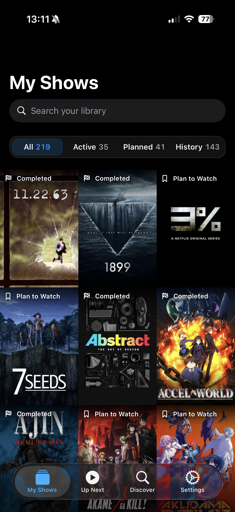
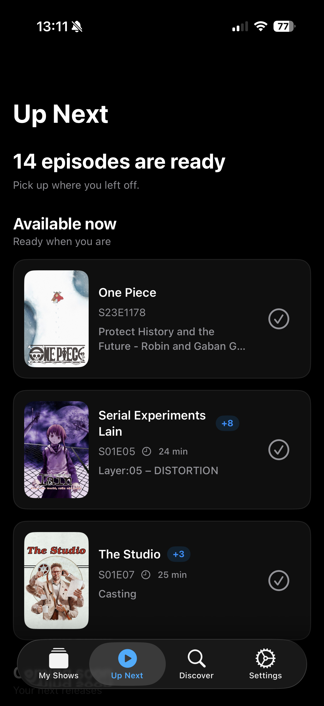
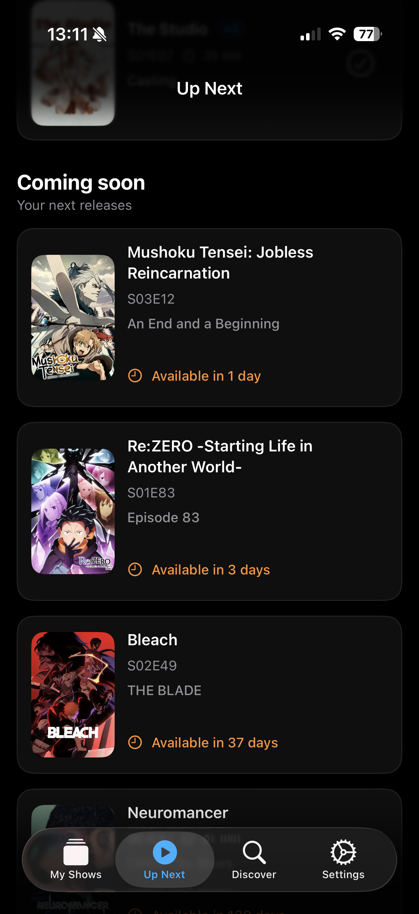
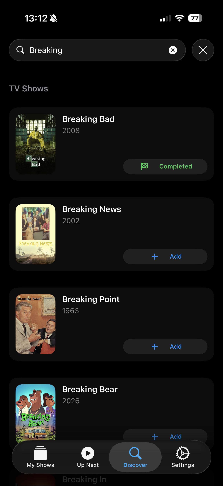
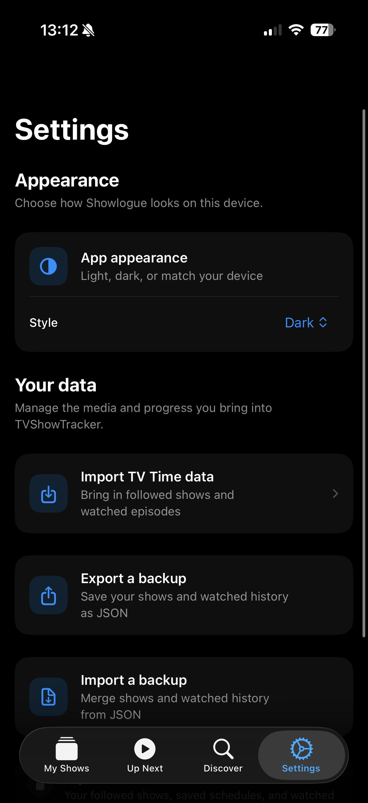
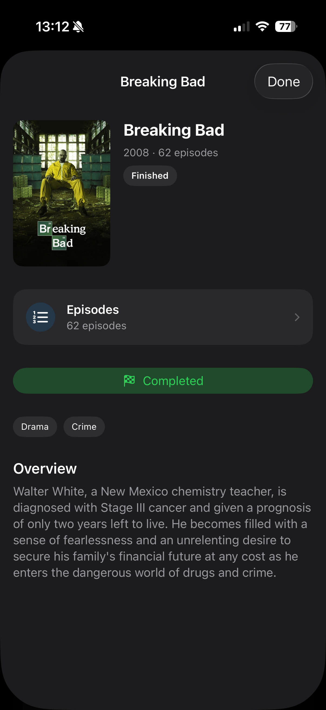
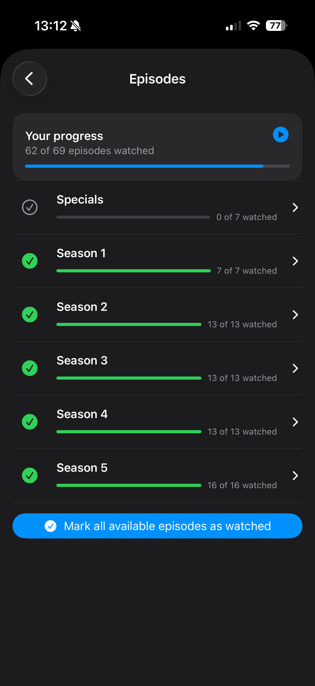
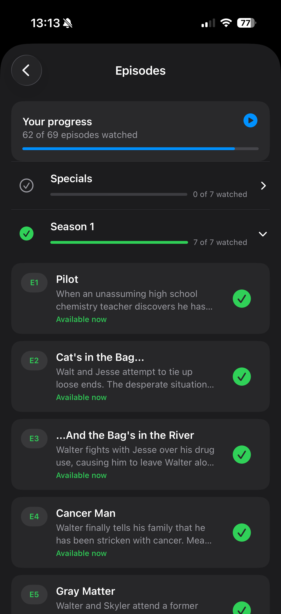
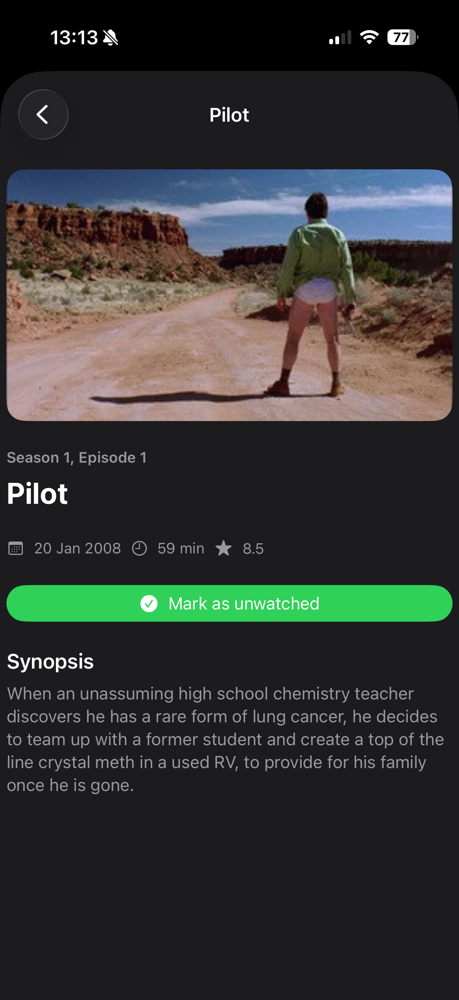

# TVShowTracker

TVShowTracker is an iOS app for tracking your favorite TV shows and anime.

**Try the public beta:** [Join on TestFlight](https://testflight.apple.com/join/wQM5paEM).

After the beloved TVShowTime app disappeared, I took the opportunity to build my own app focused on show tracking, with help from AI. This project became a hands-on way to explore Codex's capabilities.

## Introduction

Keep your shows and watch progress in one place:

- **Discover shows:** search for TV shows and anime.
- **Build your library:** save the titles you watch or plan to watch.
- **Track your progress:** mark episodes as watched and keep a record of where you left off.
- **Find your next episode:** see which released episodes you still have to watch.
- **Follow upcoming releases:** see which episodes are coming soon and when they are scheduled to air.
- **Back up and restore your data:** export your library and watch history as JSON, or import a backup to merge it with your existing data.

**Experimental: TVShowTime import.** You can also try importing your TVShowTime (TV Time) data, but this feature is currently unreliable. Watched-episode import works poorly, and show matching is approximate: some titles may be missing or matched to the wrong show. In my experience, it imports roughly 90% of the show list correctly, which can still provide a useful starting point for a large library. This is a personal estimate, not a guaranteed success rate; expect to review the imported titles and correct your watch progress manually.

## Screenshots

Explore the library, upcoming releases, discovery, and episode tracking. Select a screenshot to view it at full size.

| My Shows | Up Next · Available now | Up Next · Coming soon |
| :---: | :---: | :---: |
| <a href="Docs/Screenshots/my-shows.png"></a> | <a href="Docs/Screenshots/up-next-to-watch.png"></a> | <a href="Docs/Screenshots/up-next-coming-soon.png"></a> |

| Discover | Settings | Media details |
| :---: | :---: | :---: |
| <a href="Docs/Screenshots/discover-results.png"></a> | <a href="Docs/Screenshots/settings.png"></a> | <a href="Docs/Screenshots/media-details.png"></a> |

| Season list | Episode list | Episode details |
| :---: | :---: | :---: |
| <a href="Docs/Screenshots/season-list.png"></a> | <a href="Docs/Screenshots/episode-list.png"></a> | <a href="Docs/Screenshots/episode-details.png"></a> |

## Project setup

### Requirements

- macOS with the current version of Xcode installed.
- [Homebrew](https://brew.sh/) to install development tools.

### Run the app

1. Clone the repository and open `TVShowTracker/TVShowTracker.xcodeproj` in Xcode.
2. Choose an iOS simulator (or a connected device) and run the `TVShowTracker` scheme.

### Set up code quality tools

The repository uses SwiftFormat to format staged Swift files before a commit and SwiftLint to lint every app build. SwiftLint warnings fail the build.
Run these commands once after cloning:

```sh
brew install swiftformat swiftlint
git config core.hooksPath .githooks
```

Confirm that the formatter and hook are available:

```sh
swiftformat --version
swiftlint --version
git hook run pre-commit
```

The hook is stored in [`.githooks/pre-commit`](.githooks/pre-commit). It formats staged `.swift` files, then re-stages the formatted files before the commit is created. The app target's **SwiftLint** build phase runs `swiftlint lint --strict` on every build.

### Xcode Cloud

Xcode Cloud runs [`TVShowTracker/ci_scripts/ci_post_clone.sh`](TVShowTracker/ci_scripts/ci_post_clone.sh)
after cloning the repository. The script downloads and verifies the pinned
SwiftLint release used by the app target's strict SwiftLint build phase, so archives and
TestFlight builds use the same lint gate as local builds. Do not disable the
build phase in the distribution workflow.

The workflow also requires a `TMDB_ACCESS_TOKEN` environment variable. In the
workflow's **Environment** section, add the token as a **Secret** (with value
redaction enabled). The post-clone script writes it to the ignored
`Secrets.xcconfig` file for that build and fails clearly if it is absent. Never
store this token in Git or print it in build logs.

### Configure the TMDB token

The search feature reads a TMDB v4 read-access token from the generated app `Info.plist` key named `TMDBAccessToken`.

1. Copy `TVShowTracker/TVShowTracker/Config/Secrets.xcconfig.example` to `TVShowTracker/TVShowTracker/Config/Secrets.xcconfig`.
2. Set `TMDB_ACCESS_TOKEN` to your own TMDB **API Read Access Token**.

`TVShowTracker/TVShowTracker/Config/Secrets.xcconfig` is ignored by Git; the token is not stored in the project file or committed. Do not use the legacy TMDB API key here. AniList public search does not require a token.

### Library storage

The Library stores followed TV shows and anime locally with SwiftData, so the
saved list is available when the app is offline. Opening details or episodes
still fetches the latest provider data when a network connection is available.

### Data backups

Settings can export the user's followed titles, provider identifiers, personal
tracking statuses, and watched-episode dates as a versioned JSON backup. The
same screen can import that file later. Import merges the backup into the local
library and does not remove records that are only present on the device.

### Architecture and contribution

The project uses Swift 6 with shared media-domain models, explicit dependency
injection, repository-owned persistence, and application stores shared across
features. See [the architecture guide](Docs/Architecture.md) for the dependency
map and state contracts, and [AGENTS.md](AGENTS.md) for contribution rules and
required validation commands.
